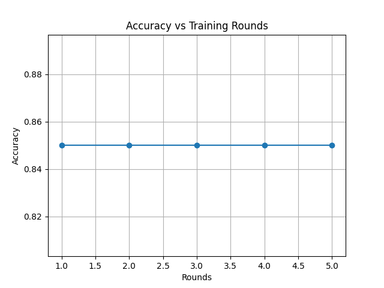
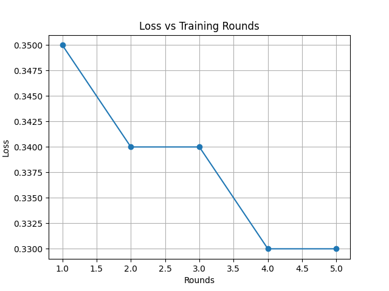
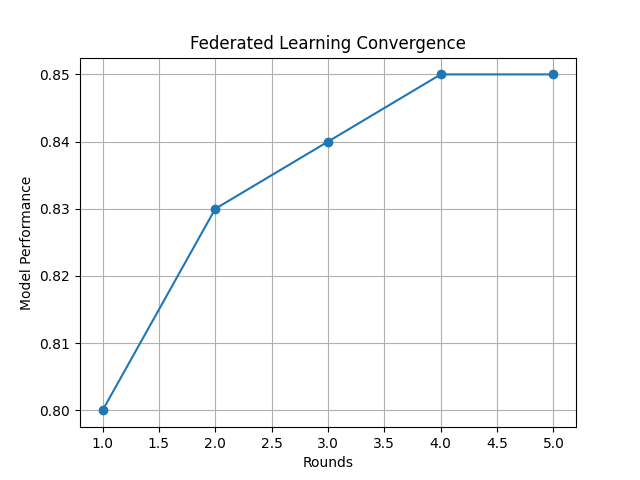
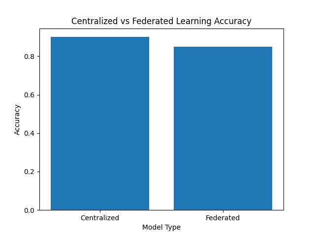

# Privacy-Preserving Federated Learning for Healthcare Data

## Project Overview

This project implements a Privacy-Preserving Federated Learning system for healthcare data using Python, Flower Framework, Machine Learning, Flask API, and Postman.

Instead of sharing patient data with a central server, multiple clients train local models and only model parameters are shared. This improves privacy while maintaining model performance.

---

## Features

- Federated Learning using Flower
- Healthcare Dataset Processing
- Data Preprocessing and Normalization
- Multi-Client Training
- Global Model Aggregation
- Performance Evaluation
- Accuracy and Loss Visualization
- Flask REST API
- Postman Integration
- Privacy-Preserving Learning

---

## Project Structure

```text
Privacy_Preserving_Federated_Learning
│
├── Code
│   ├── preprocessing.py
│   ├── client_split.py
│   ├── local_training.py
│   ├── fl_server.py
│   ├── fl_client.py
│   ├── fl_client2.py
│   ├── fl_client3.py
│   ├── fl_client4.py
│   ├── fl_client5.py
│   ├── api.py
│   └── visualize_results.py
│
├── Dataset
│   ├── healthcare_dataset.csv
│   ├── processed_healthcare_data.csv
│   └── clients
│
├── Result
│   ├── Figure_1.png
│   ├── Figure_2.png
│   ├── Figure_3.png
│   └── Figure_4.png
│
├── Instruction_Manual_FL_Project.docx
└── README.md

Technologies Used
Python
Flask
Flower
Scikit-Learn
Pandas
NumPy
Matplotlib
Postman

Installation
Clone Repository
git clone https://github.com/Ayan1611do/Federated-Learning-Healthcare.git
pip install -r requirements.txt

Running the Project
Step 1: Preprocess Dataset
- python preprocessing.py
Step 2: Split Dataset
- python client_split.py
Step 3: Start Federated Server
- python fl_server.py
Step 4: Start Clients
- python fl_client.py
- python fl_client2.py
- python fl_client3.py
- python fl_client4.py
- python fl_client5.py
Step 5: Start API
- python api.py

API Testing
Open Postman

POST Request:
- http://127.0.0.1:5000/predict

Example JSON:

{
  "Age": 1,
  "Gender": 1,
  "Blood Type": 1,
  "Medical Condition": 1,
  "Insurance Provider": 1,
  "Billing Amount": 0.5,
  "Admission Type": 1,
  "Medication": 1
}

Results
The system successfully:
- Preserves healthcare data privacy
- Trains multiple clients collaboratively
- Generates a global machine learning model
- Provides predictions through REST API
- Visualizes model performance using graphs

## Project Screenshots
### Federated Learning Execution

### Training Results

### Accuracy Graph

### Loss Graph



